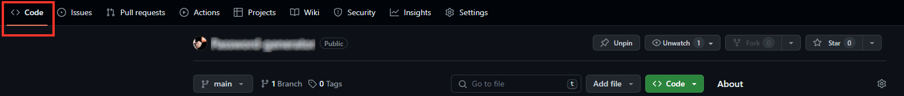
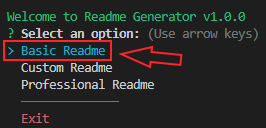
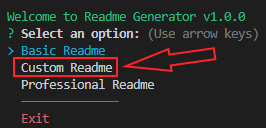
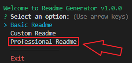

# Professional README Generator


[](https://developer.mozilla.org/en-US/docs/Web/JavaScript)
[](https://www.npmjs.com/package/inquirer)
[](https://nodejs.org/)
[](https://www.npmjs.com/package/chalk)


## Description

This is a command-line application built with ES6 and Node.js that dynamically generates a professional README.md file based on user input. It streamlines the process of creating a high-quality README for open source projects on GitHub by automating the generation process.

## Table of Contents
- [Professional README Generator](#professional-readme-generator)
  - [Description](#description)
  - [Table of Contents](#table-of-contents)
  - [Installation](#installation)
    - [Option 1 - Download](#option-1---download)
    - [Option 2 - Clone project](#option-2---clone-project)
  - [Usage](#usage)
    - [Start the application](#start-the-application)
    - [Basic README Generation](#basic-readme-generation)
    - [Custom README Generation](#custom-readme-generation)
    - [Professional README Generation](#professional-readme-generation)
    - [Terminal app preview](#terminal-app-preview)
      - [Basic option](#basic-option)
      - [Custom option](#custom-option)
      - [Professional option](#professional-option)
  - [Contributing](#contributing)
  - [Dependencies](#dependencies)
    - [Chalk 4.0.0](#chalk-400)
    - [inquirer 8.0.0](#inquirer-800)
  - [Development Dependencies](#development-dependencies)
    - [JSDoc 4.0.2](#jsdoc-402)
    - [Prettier 3.2.5](#prettier-325)
  - [Tests](#tests)
  - [Questions](#questions)
  - [Resources](#resources)
  - [License](#license)

## Installation

### Option 1 - Download

Download the project from GitHub [repository](https://github.com/FilipPaskalev/README-Generator.git) on your local machine.

1. Open GitHub repository. [(link to repository)](https://github.com/FilipPaskalev/README-Generator.git)

2. Select ```Code``` from top navigation section. (reference on the image below) 👇

    

3. Select ```<> Code``` dropdown button from sub section. (reference on the image below) 👇

    

4. Select ```Download ZIP``` from dropdown menu to download project in .zip format. (reference on the image below) 👇

    

5.  Unzip the project. 

    > [!TIP]
    > You can use 7-Zip if you don't have file archiver. 
    >**7-Zip** is **free software** with **open source**. The most of the code is under the **GNU LGPL** license. Some parts of the code are under the BSD 3-clause License. Also there is unRAR license restriction for some parts of the code. Read [7-Zip License](https://www.7-zip.org/license.txt) information. 
    > Download the application from [official website](https://www.7-zip.org/).

6.  Open project with VS Code or other IDE.

### Option 2 - Clone project

1. On GitHub.com, navigate to the main page of the repository. [(link to repository)](https://github.com/FilipPaskalev/README-Generator.git).

2. Above the list of files, click  Code. (reference on the image below) 👇

    

3. Copy the URL for the repository.
- To clone the repository using HTTPS, under "HTTPS", click <svg version="1.1" fill="#0F66B8" width="16" height="16" viewBox="0 0 16 16" aria-label="Copy to clipboard" role="img"><path d="M3.626 3.533a.249.249 0 0 0-.126.217v9.5c0 .138.112.25.25.25h8.5a.25.25 0 0 0 .25-.25v-9.5a.249.249 0 0 0-.126-.217.75.75 0 0 1 .752-1.298c.541.313.874.89.874 1.515v9.5A1.75 1.75 0 0 1 12.25 15h-8.5A1.75 1.75 0 0 1 2 13.25v-9.5c0-.625.333-1.202.874-1.515a.75.75 0 0 1 .752 1.298ZM5.75 1h4.5a.75.75 0 0 1 .75.75v3a.75.75 0 0 1-.75.75h-4.5A.75.75 0 0 1 5 4.75v-3A.75.75 0 0 1 5.75 1Zm.75 3h3V2.5h-3Z"></path></svg>
- To clone the repository using an SSH key, including a certificate issued by your organization's SSH certificate authority, click SSH, then click <svg version="1.1" fill="#0F66B8" width="16" height="16" viewBox="0 0 16 16" aria-label="Copy to clipboard" role="img"><path d="M3.626 3.533a.249.249 0 0 0-.126.217v9.5c0 .138.112.25.25.25h8.5a.25.25 0 0 0 .25-.25v-9.5a.249.249 0 0 0-.126-.217.75.75 0 0 1 .752-1.298c.541.313.874.89.874 1.515v9.5A1.75 1.75 0 0 1 12.25 15h-8.5A1.75 1.75 0 0 1 2 13.25v-9.5c0-.625.333-1.202.874-1.515a.75.75 0 0 1 .752 1.298ZM5.75 1h4.5a.75.75 0 0 1 .75.75v3a.75.75 0 0 1-.75.75h-4.5A.75.75 0 0 1 5 4.75v-3A.75.75 0 0 1 5.75 1Zm.75 3h3V2.5h-3Z"></path></svg>
- To clone a repository using GitHub CLI, click GitHub CLI, then click <svg version="1.1" fill="#0F66B8" width="16" height="16" viewBox="0 0 16 16" aria-label="Copy to clipboard" role="img"><path d="M0 6.75C0 5.784.784 5 1.75 5h1.5a.75.75 0 0 1 0 1.5h-1.5a.25.25 0 0 0-.25.25v7.5c0 .138.112.25.25.25h7.5a.25.25 0 0 0 .25-.25v-1.5a.75.75 0 0 1 1.5 0v1.5A1.75 1.75 0 0 1 9.25 16h-7.5A1.75 1.75 0 0 1 0 14.25Z"></path><path d="M5 1.75C5 .784 5.784 0 6.75 0h7.5C15.216 0 16 .784 16 1.75v7.5A1.75 1.75 0 0 1 14.25 11h-7.5A1.75 1.75 0 0 1 5 9.25Zm1.75-.25a.25.25 0 0 0-.25.25v7.5c0 .138.112.25.25.25h7.5a.25.25 0 0 0 .25-.25v-7.5a.25.25 0 0 0-.25-.25Z"></path></svg> (reference on the image below) 👇

    

1. Open Git Bash.

2. Change the current working directory to the location where you want the cloned directory.

3. Type ```git clone```, and then paste the URL you copied earlier.

    ```
    git clone https://github.com/FilipPaskalev/README-Generator.git
    ```

4. Press Enter to create your local clone.

    ```
    $ git clone https://github.com/FilipPaskalev/README-Generator.git
    > Cloning into `Spoon-Knife`...
    > remote: Counting objects: 10, done.
    > remote: Compressing objects: 100% (8/8), done.
    > remove: Total 10 (delta 1), reused 10 (delta 1)
    > Unpacking objects: 100% (10/10), done.
    ```

## Usage

### Start the application

To start the application, run the following command in your terminal:

```bash
npm start
```

When the application starts, you will be presented with a menu to choose the type of README generation:


### Basic README Generation

Choose this option to generate a skeleton README without any user input.



### Custom README Generation

Select this option to generate a README by providing information for each section interactively.



### Professional README Generation

Choose this option to generate a comprehensive README with all available options, including license selection, contributing guidelines, and more.



### Terminal app preview

#### Basic option

#### Custom option

#### Professional option

## Contributing

If you'd like to contribute to this project, please follow the guidelines outlined in the CONTRIBUTING.md file.

## Dependencies

### Chalk 4.0.0

[NPM chalk](https://www.npmjs.com/package/chalk/v/5.3.0) is a third-party Node.js module that is used to add colour and styling to text on the command-line output. It also allows creating your own themes for your Node.js project. As per the Chalk GitHub page, it is: 

>Terminal string styling done right

Chalk supports multiple text styles with backgrounds supporting different colours and formatting. For instance, you can show text in red colour with a grey background that is bold and underlined. The chalk module is easy to install and use, depending on your terminal colours it can support a lot of colours.

It is an actively maintained project without any dependencies. Chalk also has an expressive API and it is a performant library. In the next part, you will know about the popularity of the NPM chalk module.
  - Chalk is a library for styling command-line output. It provides a cleaner way to add color and styling to your console.log messages.

### inquirer 8.0.0

Inquirer is an [NPM](https://www.npmjs.com/package/inquirer/v/9.2.15?activeTab=readme#documentation) package that provides an easy way to capture user input in your Node.js command line interface applications. It provides several methods for asking questions and returning answers from the user that can be accessed by a .then promise function.

## Development Dependencies

### JSDoc 4.0.2

[JSDoc 3](https://jsdoc.app/about-getting-started) is an API documentation generator for JavaScript, similar to Javadoc. You add documentation comments directly to your source code, right alongside the code itself. The JSDoc tool will scan your source code and generate an HTML documentation website for you.

JSDoc's purpose is to document the API of your JavaScript application or library. It is assumed that you will want to document things like modules, namespaces, classes, methods, method parameters, and so on.

### Prettier 3.2.5

Prettier is an opinionated code formatter with support for:

- JavaScript (including experimental features)
- JSX
- Angular
- Vue
- Flow
- TypeScript
- CSS, Less, and SCSS
- HTML
- Ember/Handlebars
- JSON
- GraphQL
- Markdown, including GFM and MDX v1
- YAML

It removes all original styling* and ensures that all outputted code conforms to a consistent style. (See this [blog post](https://archive.jlongster.com/A-Prettier-Formatter))

Prettier takes your code and reprints it from scratch by taking the line length into account.


## Tests
Automated tests can be added in the future to ensure the stability and functionality of the application. At version 1.0.0 are no tests.

## Questions
If you have any questions or need further assistance, feel free to reach out:
- GitHub: [My GitHub](https://github.com/FilipPaskalev)
- Email: [My Email Address](mailto:paskalevfilip@gmail.com)

## Resources
 | [Link 1](https://www.markdownguide.org/cheat-sheet/) | 
[Link 2](https://www.markdownguide.org/extended-syntax/#copying-and-pasting-emoji) | 
[Link 3](https://emojipedia.org/) | 
[Link 4](https://markdownguide.offshoot.io/extended-syntax/) | 
[Link 5](https://www.digitalocean.com/community/tutorials/nodejs-interactive-command-line-prompts) | 
[Link 6](https://github.com/SBoudrias/Inquirer.js/blob/master/packages/inquirer/README.md) | 
[Link 7](https://coding-boot-camp.github.io/full-stack/github/professional-readme-guide) | 
[Link 8](https://opensource.org/license/bsl-1-0/) | 
[Link 9](https://github.com/licenses/license-templates) | 
[Link 10](https://stackoverflow.com/questions/10049557/reading-all-files-in-a-directory-store-them-in-objects-and-send-the-object) | 
https://contributing.md/example/


## License

[](https://opensource.org/licenses/MIT)


Copyright (c) 2024 Phil

Permission is hereby granted, free of charge, to any person obtaining a copy
of this software and associated documentation files (the "Software"), to deal
in the Software without restriction, including without limitation the rights
to use, copy, modify, merge, publish, distribute, sublicense, and/or sell
copies of the Software, and to permit persons to whom the Software is
furnished to do so, subject to the following conditions:

The above copyright notice and this permission notice shall be included in all
copies or substantial portions of the Software.

THE SOFTWARE IS PROVIDED "AS IS", WITHOUT WARRANTY OF ANY KIND, EXPRESS OR
IMPLIED, INCLUDING BUT NOT LIMITED TO THE WARRANTIES OF MERCHANTABILITY,
FITNESS FOR A PARTICULAR PURPOSE AND NONINFRINGEMENT. IN NO EVENT SHALL THE
AUTHORS OR COPYRIGHT HOLDERS BE LIABLE FOR ANY CLAIM, DAMAGES OR OTHER
LIABILITY, WHETHER IN AN ACTION OF CONTRACT, TORT OR OTHERWISE, ARISING FROM,
OUT OF OR IN CONNECTION WITH THE SOFTWARE OR THE USE OR OTHER DEALINGS IN THE
SOFTWARE.